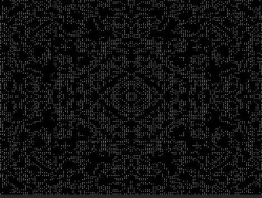

## C 语言学习

>月牙博客




### C语言基础部分


#### 第一章 C语言概述

#### 1.1 C语言发展
`计算机语言`

- 机器语言
- 汇编语言
- 高级语言


#### 1.2 C语言特点

- 语言简洁
- 运算符丰富
- 具有结构化的控制语句
- 语法限制不太严格
`高级语言的发展`
1. 非结构化语言
2. 结构化语言
3. 面向对象语言

#### 1.3 最简单的C语言

```c
#include <stdio.h>
int main(void)
{
    printf("Hello World!\n);
    return 0;
}
```
#### 1.4 注释

```c
#include <stdio.h>
int main(void)
{
    /*
    There will be not output  Hello World!
    */
    //printf("Hello World!\n);
    return 0;
}
```


### 第二章 算法

#### 2.1 什么是算法

#### 2.2 简单的算法举例

#### 2.3 三种基本结构和改进的流程图


