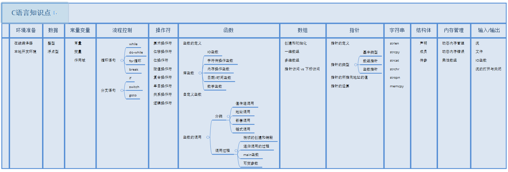

> C语言学习手册

---

- [C语言初级教程](#c语言初级教程)
- [C语言进阶教程](#c语言进阶教程)
- [C语言高级教程](#c语言高级教程)

# C语言初级教程

> 思维导图 [思维导图链接](ABasic/C语言知识点.xmind)

> 学习导图

| [环境准备](ABasic\CH001\环境准备.md) | 数据类型 | 常量变量  |
| ------------------------------------ | -------- | --------- |
| 流程控制                             | 操作符   | 函数      |
| 数组                                 | 指针     | 字符串    |
| 结构体                               | 内存管理 | 输入/输出 |

# C语言进阶教程

# C语言高级教程