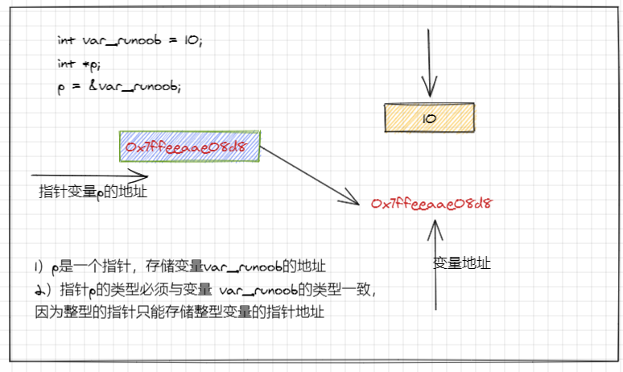

## C 语言学习

>2021 12 08


# 目录

- [目录](#目录)
    - [C语言基础部分](#c语言基础部分)
      - [第一章 C语言概述](#第一章-c语言概述)
      - [1.1 C语言发展](#11-c语言发展)
      - [1.2 C语言特点](#12-c语言特点)
      - [1.3 最简单的C语言](#13-最简单的c语言)
      - [1.4 注释](#14-注释)
      - [1.5 数据类型](#15-数据类型)
      - [1.6 存储类](#16-存储类)
      - [1.7 C语言运算符](#17-c语言运算符)
    - [第二章 算法](#第二章-算法)
      - [2.1 什么是算法](#21-什么是算法)
      - [2.2 简单的算法举例](#22-简单的算法举例)
      - [2.3 三种基本结构和改进的流程图](#23-三种基本结构和改进的流程图)
    - [第三章 语句](#第三章-语句)
      - [3.1 表达式语句](#31-表达式语句)
      - [3.2 语句块](#32-语句块)
      - [3.3 循环](#33-循环)
      - [3.4 选择语句](#34-选择语句)
      - [3.5 无条件跳转](#35-无条件跳转)
    - [第四章 类型转换](#第四章-类型转换)
    - [第五章 表达式和运算符](#第五章-表达式和运算符)
    - [第六章 函数](#第六章-函数)
    - [第七章 数组](#第七章-数组)
    - [第八章 指针](#第八章-指针)
      - [8.1 声明指针](#81-声明指针)
      - [8.2 指针运算](#82-指针运算)
      - [8.3 数组的指针和指针的数组](#83-数组的指针和指针的数组)
      - [8.4 指向函数的指针](#84-指向函数的指针)
    - [第九章 结构、联合与位字段](#第九章-结构联合与位字段)
      - [9.1 数据结构](#91-数据结构)


### C语言基础部分


#### 第一章 C语言概述

#### 1.1 C语言发展
`计算机语言`

- 机器语言
- 汇编语言
- 高级语言

C 语言是一种通用的、面向过程式的计算机程序设计语言。1972 年，为了移植与开发 UNIX 操作系统，丹尼斯·里奇在贝尔电话实验室设计开发了 C 语言。
C 语言是一种广泛使用的计算机语言，它与 Java 编程语言一样普及，二者在现代软件程序员之间都得到广泛使用。
当前最新的 C 语言标准为 C18 ，在它之前的 C 语言标准有 C17、C11...C99 等。
#### 1.2 C语言特点

- 语言简洁
- 运算符丰富
- 具有结构化的控制语句
- 语法限制不太严格
`高级语言的发展`
1. 非结构化语言
2. 结构化语言
3. 面向对象语言

#### 1.3 最简单的C语言

```c
#include <stdio.h>
int main(void)
{
    printf("Hello World!\n);
    return 0;
}
```


* 所有的 C 语言程序都需要包含 main() 函数。 代码从 main() 函数开始执行。
* /* ... */ 用于注释说明。
printf() 用于格式化输出到屏幕。printf() 函数在 "stdio.h" 头文件中声明。
* stdio.h 是一个头文件 (标准输入输出头文件) , #include 是一个预处理命令，用来引入头文件。 当编译器遇到 * printf() 函数时，如果没有找到 stdio.h 头文件，会发生编译错误。
* return 0; 语句用于表示退出程序。
#### 1.4 注释

```c
#include <stdio.h>
int main(void)
{
    /*
    There will be not output  Hello World!
    */
    //printf("Hello World!\n);
    return 0;
}
```

#### 1.5 数据类型

变量其实只不过是程序可操作的存储区的名称。C 中每个变量都有特定的类型，类型决定了变量存储的大小和布局，该范围内的值都可以存储在内存中，运算符可应用于变量上。

变量的名称可以由字母、数字和下划线字符组成。它必须以字母或下划线开头。大写字母和小写字母是不同的，因为 C 是大小写敏感的。基于前一章讲解的基本类型，有以下几种基本的变量类型：


> 程序必须使用不同的方式来存储和处理不同类型的数据

* 基本类型
  * 标准整数类型
  * 实数浮点类型
  
* 枚举类型

* void类型

  > void 类型修饰符(type specifier)表示"没有值可以获得"。因此，不可以采用这个类型声明变量或常量。

  * void用于函数声明

    > void类型表达式指的是没有值的表达式。
    >
    > void 类型的表达式
    >
    > ```c
    > char filrename[] = "momo.txt"
    >  if(fopen(filename,"r") == NULL)
    >  {
    >      perros(filename);//void表达式
    >  }
    > ```
    >
    > 类型转换(cast)运算(void)表达式显式地将表达式的返回值丢弃
    >
    > ```c
    > (void)printf("I do not need this function's return value!\n");
    > ```
    >
    > 

  * void类型表达式

  * 指向void的指针

* 派生类型

* 联合类型

* 函数类型


#### 1.6 存储类

> 存储类定义 C 程序中变量/函数的范围（可见性）和生命周期。这些说明符放置在它们所修饰的类型之前。下面列出 C 程序中可用的存储类：

* auto
* register
* static
* extern


#### 1.7 C语言运算符

>运算符是一种告诉编译器执行特定的数学或逻辑操作的符号。C 语言内置了丰富的运算符，并提供了以下类型的运算符：

* 算术运算符
* 关系运算符
* 逻辑运算符
* 位运算符
* 赋值运算符
* 杂项运算符


### 第二章 算法

#### 2.1 什么是算法

```markdown
(1)算法是一系列解决问题的清晰指令，也就是说，能够对一定规范的输入，在有限时间内获得所要求的输出。算法常常含有重复的步骤和一些比较或逻辑判断。如果一个算法有缺陷，或不适合于某个问题，执行这个算法将不会解决这个问题。不同的算法可能用不同的时间、空间或效率来完成同样的任务。一个算法的优劣可以用空间复杂度与时间复杂度来衡量。
(2)算法的时间复杂度是指算法需要消耗的时间资源。一般来说，计算机算法是问题规模n 的函数f(n)，算法执行的时间的增长率与f(n) 的增长率正相关，称作渐进时间复杂度（Asymptotic Time Complexity）。时间复杂度用“O（数量级）”来表示，称为“阶”。常见的时间复杂度有： O（1）常数阶；O（log2n）对数阶；O（n）线性阶；O（n2）平方阶。
(3)算法的空间复杂度是指算法需要消耗的空间资源。其计算和表示方法与时间复杂度类似，一般都用复杂度的渐近性来表示。同时间复杂度相比，空间复杂度的分析要简单得多。
```


#### 2.2 简单的算法举例

#### 2.3 三种基本结构和改进的流程图


### 第三章 语句

#### 3.1 表达式语句

> 表达式语句(expression statement)是后面跟着一个分号的表达式

#### 3.2 语句块

C Hello World 实例
C 程序主要包括以下部分：

* 预处理器指令
* 函数
* 变量
* 语句 & 表达式
* 注释
* 让我们看一段简单的代码，可以输出单词 "Hello World"：

```c
#include <stdio.h>
 
int main()
{
   /* 我的第一个 C 程序 */
   printf("Hello, World! \n");
   
   return 0;
}
```

接下来我们讲解一下上面这段程序：

1. 程序的第一行 #include <stdio.h> 是预处理器指令，告诉 C 编译器在实际编译之前要包含 stdio.h 文件。
2. 下一行 int main() 是主函数，程序从这里开始执行。
3. 下一行 /*...*/ 将会被编译器忽略，这里放置程序的注释内容。它们被称为程序的注释。
4. 下一行 printf(...) 是 C 中另一个可用的函数，会在屏幕上显示消息 "Hello, World!"。
5. 下一行 return 0; 终止 main() 函数，并返回值 0。

#### 3.3 循环

#### 3.4 选择语句

#### 3.5 无条件跳转


### 第四章 类型转换


### 第五章 表达式和运算符


### 第六章 函数

### 第七章 数组

### 第八章 指针

> 指针(pointer)是对数据对象或函数的一种引用。指针有多种用途，例如定义"传址调用"函数，它还可以实现动态数据结构，例如链表和树。


> 指针也就是内存地址，指针变量是用来存放内存地址的变量。就像其他变量或常量一样，您必须在使用指针存储其他变量地址之前，对其进行声明。指针变量声明的一般形式为：




#### 8.1 声明指针


#### 8.2 指针运算


#### 8.3 数组的指针和指针的数组


#### 8.4 指向函数的指针


### 第九章 结构、联合与位字段

#### 9.1 数据结构


